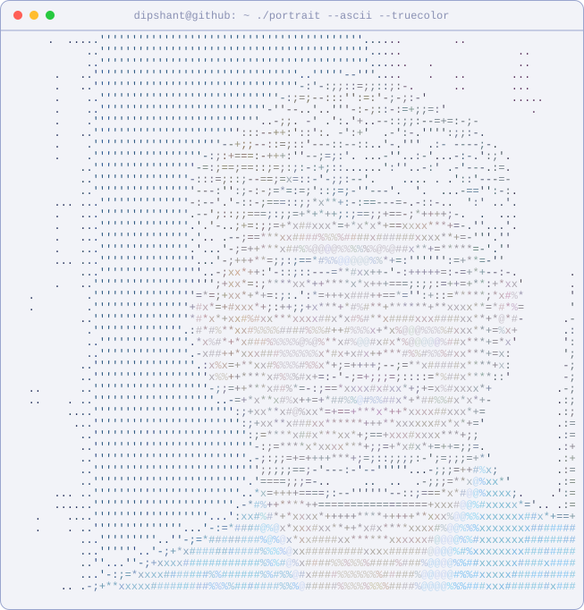
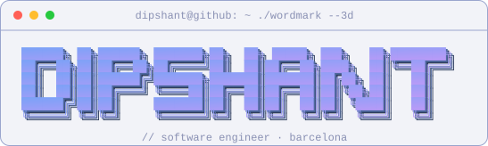
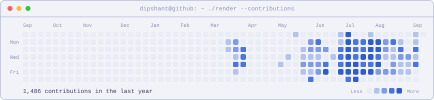
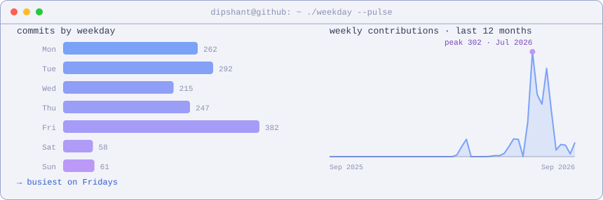

<!-- ============================================================
     GENERATED FILE — do not edit README.md directly.
     Edit templates/README.tpl.md, then run:  python scripts/build_readme.py
     Theme: change ACTIVE_THEME in scripts/theme.py (one line),
     rerun the render scripts + build_readme.py, commit.
     Daily refresh: .github/workflows/update-profile-art.yml
     ============================================================ -->
<div align="center">


<table>
<tr>
<td valign="top"></td>
<td valign="top"></td>
</tr>
</table>

</div>

## `dipshant@github:~$ whoami`

```text
Dipshant Paudel — Software Engineer @ Futurity Systems (Barcelona)
Building things with Python, React/Vue on the front, Kotlin on Android.
Everything on this page regenerates itself daily via GitHub Actions.
```

## `dipshant@github:~$ ls ./stack`

<div align="center">


<br/>


</div>

## `dipshant@github:~$ git stats`

<div align="center">

<table>
<tr>
<td></td>
<td></td>
</tr>
</table>


</div>

## `dipshant@github:~$ ./render --contributions`

<div align="center">








</div>

## `dipshant@github:~$ ./snake --eat-contributions`

<div align="center">

<picture>
<source media="(prefers-color-scheme: dark)" srcset="https://raw.githubusercontent.com/Dishantpaudel/Dishantpaudel/output/github-snake-dark.svg" />

</picture>

</div>

## `dipshant@github:~$ curl dipshant --contact`

<div align="center">

<a href="https://www.linkedin.com/in/dipshant-paudel-b04651245/"></a>
<a href="https://github.com/Dishantpaudel"></a>
<a href="https://futurity.systems"></a>

<br/><br/>


<sub>every pixel above regenerates itself daily · built with Python + GitHub Actions</sub>

</div>
